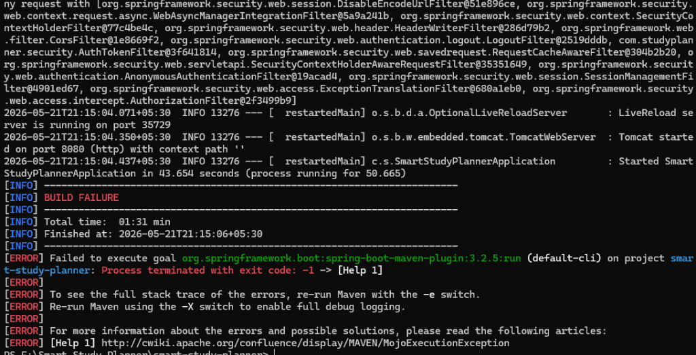
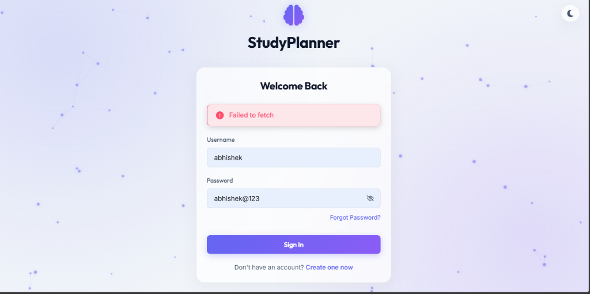
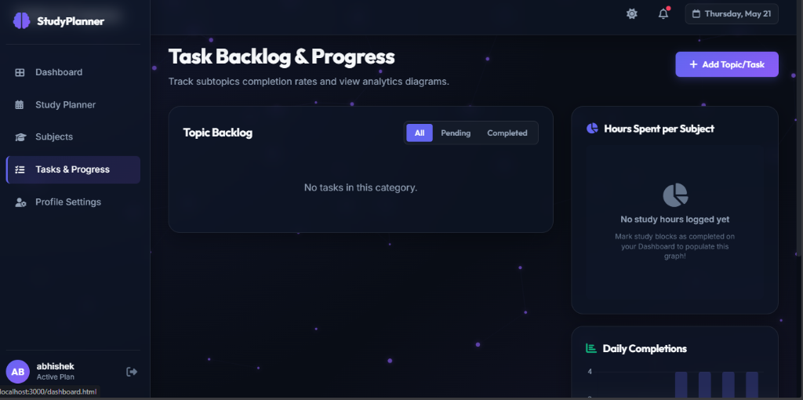
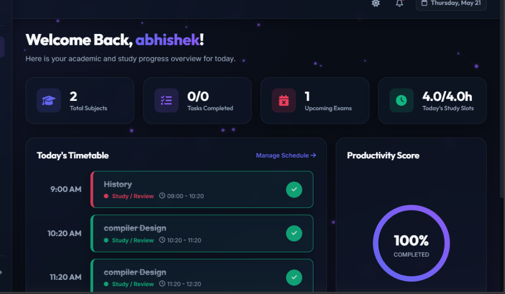
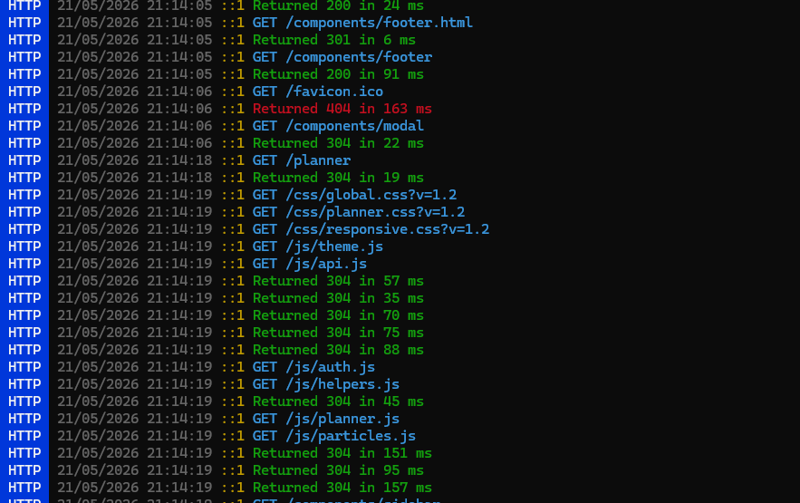

# 🎓 Smart Study Planner

[](https://www.oracle.com/java/)
[](https://spring.io/projects/spring-boot)
[](https://www.mysql.com/)
[](https://developer.mozilla.org/en-US/)
[](https://opensource.org/licenses/MIT)

**Smart Study Planner** is a modern, responsive, full-stack student productivity web application. It features a gorgeous **glassmorphic dark-theme design** and uses an advanced **Fair-Share Priority Scheduling Heuristic** to dynamically generate personalized weekly study timetables. It optimizes study time based on course difficulty, upcoming exam deadlines, and pending tasks in the student's backlog.

---

## 📸 Interface Showcase

Below are actual screenshots demonstrating the application's premium glassmorphic UI and feature set:

### 1. Dynamic Glassmorphic Dashboard & Interactive Timetable
The main hub tracks daily progress, displays an SVG productivity completion ring, and presents the scheduled hourly study blocks.


### 2. Secure Portal with Show/Hide Password & Reset Modal
A beautiful, unified entry card featuring B-Crypted JWT credentials, an eye-toggle button for input visibility, and a fully functional password reset popup.


### 3. Subject Portfolio & Exam Scheduler
A custom course grid with hex color labels, session durations, and an upcoming exam schedule creator.


### 4. Tasks Backlog & Analytics Progress
Visualize subject coverage and study hour breakdowns using Chart.js interactive pie and bar graphs. Completing slots automatically updates task backlogs.


### 5. Profile & Preferences Setup
Tailor daily study hour limits, preferred start times, and secure credentials from a sleek dashboard profile panel.


---

## ⚡ Key Features

- **Prioritized Study Timetable Generator**: A specialized heuristic algorithm that maps courses onto daily schedules according to difficulty, upcoming exams, and backlog work.
- **Glassmorphic Responsive UI**: Sleek styling with custom dark-glass cards, blur backdrops, persistent theme memory (Light/Dark toggling), and active mobile navigation drawers.
- **Bidirectional Completion Sync**: Checking off a scheduled study slot on the dashboard automatically marks the linked backlog task as complete, updating real-time analytics instantly.
- **Visual Performance Charts**: Dynamic charts showing hours spent per subject and daily study statistics powered by Chart.js.
- **Security & Authorization**: BCrypt password encryption combined with stateless JSON Web Token (JWT) bearer verification for secure, persistent logins.
- **One-Click Local Deployment**: Launcher scripts to clean port locks, test dependency runtimes, initialize MySQL, compile, and run the backend/frontend services automatically.

---

## 🛠️ Technology Stack

- **Frontend Client**: HTML5, Vanilla CSS3 (Custom Variables, Flexbox/Grid layouts), Vanilla ES6 JavaScript, Chart.js, FontAwesome Icons, Canvas Particle Physics background.
- **Application Backend**: Java 17+, Spring Boot, Spring Security (JWT authentication), Spring Data JPA (Hibernate ORM).
- **Database Server**: MySQL 8.0+ (Relational schema with cascade updates and index mappings).

---

## 🔬 Core Heuristic Scheduling Algorithm

At the heart of the Smart Study Planner is a customized priority allocation engine implemented in [PlannerService.java](backend/src/main/java/com/studyplanner/service/PlannerService.java).

For each subject $S$, the dynamic priority $P(S)$ is computed daily:

$$P(S) = (D(S) \times 2.5) + U(S) + W(S) - H(S)$$

### Parameters Breakdown:
1. **Difficulty Weight ($D(S)$)**: Scales subject baseline priority:
   - `HARD` = $10.0$
   - `MEDIUM` = $5.0$
   - `EASY` = $2.0$
2. **Urgency Weight ($U(S)$)**: Exponentially increases priority as the nearest exam date approaches:
   $$U(S) = \frac{15.0}{\text{DaysRemaining} + 1.0}$$
3. **Workload Weight ($W(S)$)**: Integrates pending backlog:
   $$W(S) = \text{Count of pending tasks} \times 1.5$$
4. **Fair-Share Satisfaction Penalty ($H(S)$)**: Prevents starvation of lighter subjects. A subject's penalty scales proportionally to its scheduled hours relative to its baseline weight:
   $$H(S) = \frac{\text{Cumulative Hours Scheduled in Plan}}{\text{PriorityWeight}} \times 15.0$$
   *This ensures a Hard subject naturally claims more hours without completely blocking Easy/Medium subjects.*

---

## 📁 Repository Directory Structure

```
smart-study-planner/
├── run-project.bat           # Easy double-click Windows launcher
├── run-project.ps1           # Environment diagnostic and automation engine
├── run-maven.ps1             # Local Maven wrapper utility
├── database/
│   ├── schema.sql            # MySQL table structure (constraints and indices)
│   └── sample-data.sql       # Initial mock user, preferences, and data
├── screenshots/              # GitHub showcase images
├── backend/
│   ├── pom.xml               # Maven configuration
│   └── src/main/
│       ├── resources/
│       │   └── application.properties # App configs (Port 8080, DB connection)
│       └── java/com/studyplanner/
│           ├── SmartStudyPlannerApplication.java
│           ├── entity/       # User, Preference, Subject, Exam, Task, Slot entities
│           ├── repository/   # JPA repository layer interfaces
│           ├── security/     # Spring Security configuration and JWT token filters
│           ├── dto/          # Serialization request and response mappings
│           ├── service/      # Auth, Task, and Priority Scheduler services
│           └── controller/   # REST API routing controllers
└── frontend/
    ├── index.html            # Public welcome page
    ├── login.html            # Secure sign-in panel (contains reset credentials modal)
    ├── register.html         # Portal signup form
    ├── dashboard.html        # Interactive timetable and productivity ring
    ├── planner.html          # Schedule generator controls
    ├── subjects.html         # Subject registry and exam deadlines
    ├── progress.html         # Checklist tasks and analytics graphs
    ├── profile.html          # Study settings and password updating
    ├── css/                  # Styling files (global rules, page grids, responsive sheets)
    ├── components/           # Dynamic templates (navigation, sidebar, footer)
    └── js/                   # Javascript engine (REST client, helper loaders, DOM controllers)
```

---

## 🚀 Getting Started

### Prerequisites
Make sure you have the following installed on your machine:
- **Java Development Kit (JDK)**: Version 17 or higher
- **Node.js & NPM**: Installed globally (used to serve static frontend files)
- **MySQL Server**: Running on default port `3306`

### Option 1: Automatic Launch (Recommended)
We provide a single-click script that clears port locks, checks environment runtimes, compiles, and opens the app:
1. Make sure your local MySQL server is active.
2. Double-click the **[run-project.bat](./run-project.bat)** file in the project root.
3. The script will boot the Java API server (Port `8080`), serve the static frontend (Port `3000`), and launch your default browser to the login page.

---

### Option 2: Manual Step-by-Step Installation

#### Step 1: Database Setup
1. Open your MySQL client and create the target schema:
   ```sql
   CREATE DATABASE smart_study_planner;
   ```
2. Import the database tables and sample records:
   ```bash
   mysql -u root -p smart_study_planner < database/schema.sql
   mysql -u root -p smart_study_planner < database/sample-data.sql
   ```

#### Step 2: Configure & Start Spring Boot Backend
1. Open [application.properties](backend/src/main/resources/application.properties) and update your database credentials if necessary:
   ```properties
   spring.datasource.username=root
   spring.datasource.password=your_password
   ```
2. Navigate to the `backend/` directory:
   ```bash
   cd backend
   ```
3. Run and start the backend service:
   ```bash
   # On Windows (PowerShell wrapper)
   powershell.exe -ExecutionPolicy Bypass -File ..\run-maven.ps1 spring-boot:run
   
   # Or using standard Maven
   mvn spring-boot:run
   ```
   *The server will boot and listen for API calls on `http://localhost:8080`.*

#### Step 3: Run the Frontend Client
1. Navigate to the project root directory and start a local HTTP server:
   ```bash
   # Serves the 'frontend' folder on port 3000
   npx serve -l 3000 frontend
   ```
2. Open your web browser and go to: `http://localhost:3000`

---

## 🔑 Test Account Credentials

You can log in and instantly try out all planner functions using our pre-loaded test database user:
- **Username**: `john_doe`
- **Password**: `password123`

---

## 📄 License
This project is licensed under the MIT License - see the [LICENSE](LICENSE) file for details.
