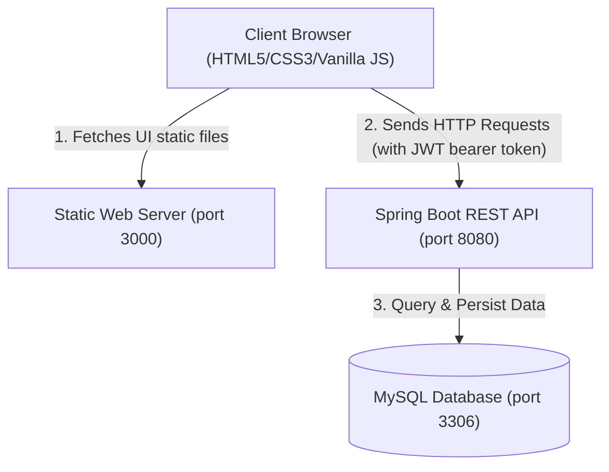
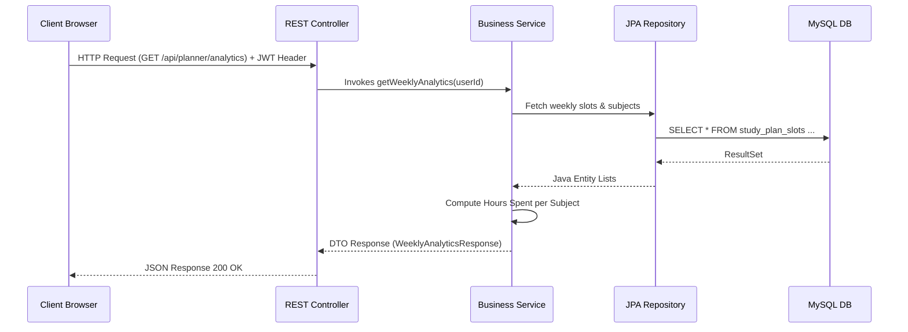
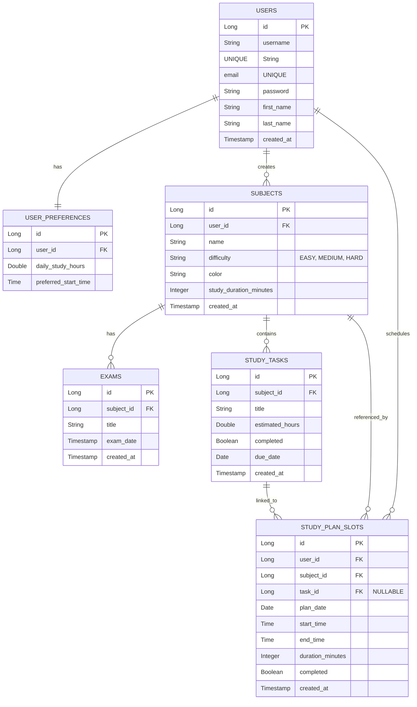

# System Architecture Specification - Smart Study Planner

This document provides a detailed description of the system architecture, design patterns, database schema, and core algorithms of the **Smart Study Planner**. This content is designed to be used directly in your **Software Requirements Specification (SRS)**.

---

## 1. System Overview & Technology Stack

The Smart Study Planner is a web-based student productivity platform that dynamically schedules study blocks based on academic subject difficulty, upcoming exams, and task backlogs.

| Layer | Technology | Purpose |
| :--- | :--- | :--- |
| **Frontend Client** | HTML5, Vanilla CSS3, Vanilla JS, Chart.js, FontAwesome | Responsive UI, custom glassmorphism components, interactive dashboards, and progress analytics. |
| **Application Backend** | Java 17+, Spring Boot, Spring Security, Hibernate/JPA | REST API development, routing, business logic, validation, authentication, and database access. |
| **Database Server** | MySQL 8.0+ | Relational data persistence, foreign key constraint handling, and referential integrity. |

---

## 2. Architectural Design Patterns

The application follows the **Separation of Concerns (SoC)** principle using two primary patterns:
1. **Single Page Application (SPA) Routing & Client-Side Hydration**: The frontend relies on helper scripts to dynamically load and cache header, navbar, sidebar, and footer components without duplicating HTML markup.
2. **Model-View-Controller (MVC) Tiered Backend**: The backend is organized into three discrete decoupled layers:
   - **Controller Layer (Presentation)**: Exposes REST API endpoints, handles requests, validates input payloads, and returns JSON transfer objects (DTOs).
   - **Service Layer (Business Logic)**: Implements core algorithms (priority scheduling, analytics calculations, user authentication).
   - **Repository Layer (Data Access)**: Spring Data JPA interfaces that translate Java object manipulations into SQL queries.

---

## 3. Database Schema Design (Entity Relationship)

The relational schema is configured with cascade rules to maintain integrity when items are deleted.

---

## 4. REST API Endpoint Specifications

The backend exposes stateless JSON endpoints protected by a security filter chain:

### Authentication Endpoints (Public)
- `POST /api/auth/register` : Registers a new user.
- `POST /api/auth/login` : Validates credentials, returns JWT Token and User Profile.

### Subject & Exam Management (Protected)
- `GET /api/subjects` : Fetches subjects created by the user.
- `POST /api/subjects` : Adds a new subject to the portfolio.
- `DELETE /api/subjects/{id}` : Deletes a subject (cascades to tasks, slots, and exams).
- `POST /api/exams` : Schedules a new exam.

### Task Backlog & Planner (Protected)
- `GET /api/tasks` : Fetches the backlog of topics/tasks.
- `POST /api/tasks` : Adds a new task/topic.
- `PUT /api/tasks/{id}/complete` : Toggles task completion status.
- `POST /api/planner/generate` : Triggers the timetabling algorithm to create plan slots.
- `GET /api/planner/daily` : Fetches scheduled slots for a given date.
- `PUT /api/planner/slots/{id}/complete` : Toggles slot completion and synchronizes task completion.
- `GET /api/planner/summary` : Returns summary counters for the dashboard view.
- `GET /api/planner/analytics` : Returns weekly hours spent per subject and daily slot completions.

---

## 5. Security & Session Model

The application uses **stateless token-based authentication** (JWT):

1. **Password Hashing**: User passwords are encrypted using the **BCrypt** hashing function with a strength factors index of 10 prior to storage.
2. **Access Control**: Every endpoint under `/api/auth/**` is public. All other endpoints are intercepted by `AuthTokenFilter`.
3. **Authentication Filter Flow**:
   - Client includes `Authorization: Bearer <JWT_TOKEN>` header.
   - Filter parses token, extracts the username, and queries user details.
   - Places user credentials inside Spring Security's `SecurityContextHolder` context.
   - Decoupled REST controllers fetch the user's ID via `SecurityContextHolder.getContext().getAuthentication().getPrincipal()`.

---

## 6. Timetabling & Prioritization Algorithm

The core engine schedules tasks using a dynamic heuristic scoring model.

### 1. Subject Priority Score Formula
For each subject $S$, the dynamic priority $P(S)$ is computed daily:
$$P(S) = (D(S) \times 2.5) + U(S) + W(S) - H(S)$$

Where:
* **$D(S)$ (Difficulty Weight)**: Hard = 3.0, Medium = 2.0, Easy = 1.0.
* **$U(S)$ (Urgency Weight)**: Score based on days remaining until the nearest exam for subject $S$:
  $$U(S) = \frac{15.0}{\text{DaysRemaining} + 1.0}$$
* **$W(S)$ (Workload Weight)**: Represents the size of the task backlog for subject $S$:
  $$W(S) = \text{Count of pending tasks} \times 1.5$$
* **$H(S)$ (Satisfaction Penalty)**: Ensures subjects rotate fairly. Each time a slot is scheduled for subject $S$, its priority is reduced for the remainder of the generation run:
  $$H(S) = \text{Cumulative Hours Scheduled in plan} \times 5.0$$

### 2. Allocation Loop
* The algorithm parses the start/end date range.
* For each day, starting at `preferredStartTime` (e.g. `09:00`), it schedules blocks corresponding to the subject's duration settings (e.g. 60 or 80 minutes) until the `dailyStudyHours` limit is met.
* In **Heuristic Mode**, it selects the subject with the highest priority score, assigns the first pending task from that subject's backlog, generates the `StudyPlanSlot`, and applies the satisfaction penalty $H(S)$.
* In **Equal Distribution Mode**, it divides daily study hours equally among all subjects and schedules them sequentially.
